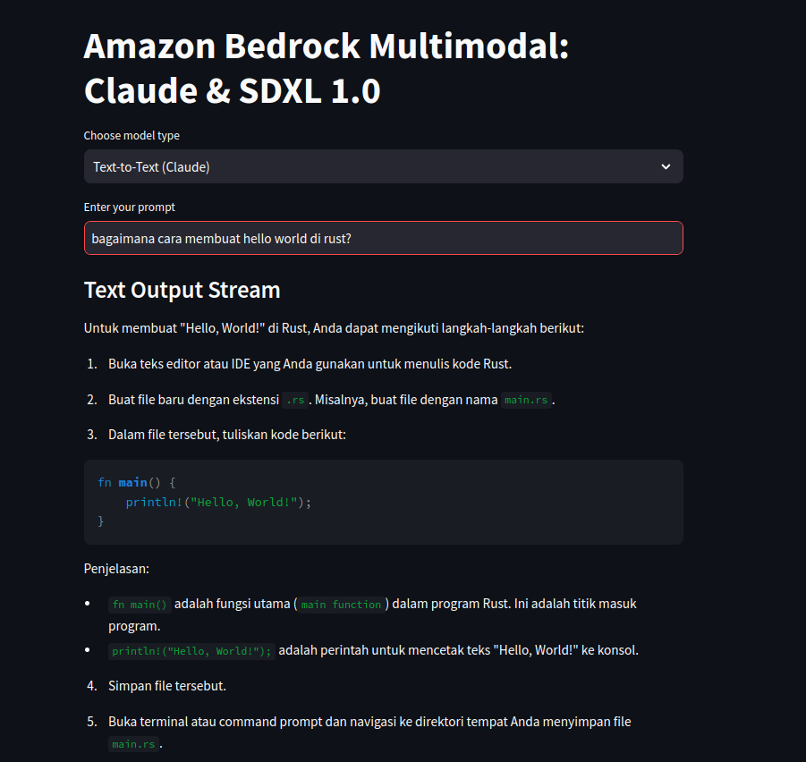
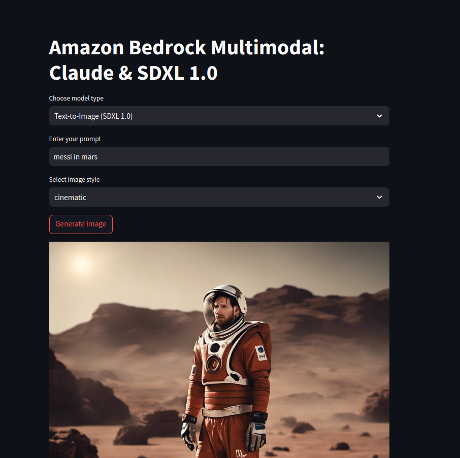

# AWS Bedrock Multimodal App

Multimodal webui built using Streamlit and Amazon Bedrock, leveraging Claude for text-to-text generation and SDXL for text-to-image generation.

Text to text (Claude-3-haiku)

Text to image (Stable-Diffusion-XL)

